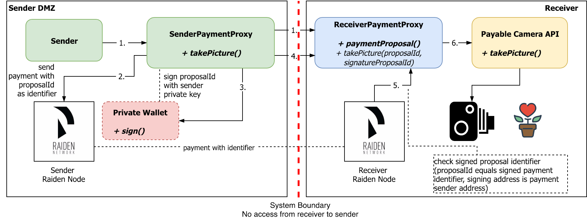

# Payable APIs with Raiden Network Payment Channels [overview]

Root project for all components necessary for the demo setup of the 

# Prerequisites

* Java 8+
* optional: Git

# Complete Demo Setup

For the complete demo setup, you have to have all the components up and running.

| Service | Port |
| --- | --- |
| [Sender Payment Proxy](...) | 9000 |
| [Raiden Node](...) | 9200 | 
| [Ethereum Transaction Signer](...) | 9300 | 
| [Receiver Payment Proxy](...) | 9500 |
| [Camera API](...) | 9100 |

| Environment Variable | Default Value |
| --- | --- |
| RECEIVER_ADDRESS | 0x627306090abaB3A6e1400e9345bC60c78a8BEf57 |
| SENDER_ADDRESS | 0x2284737b7c15c6119589854631c31A7E599A3dB3 |
| TOKEN_ADDRESS | 0x0000000000000000000000000000000000000001 |
| SIGNER_PRIVATE_KEY | a27fe45bfd9e40ff8ce043f4e8fe6f5dd05c8c6a5ff8494fbe334349500830b5 (see SENDER_ADDRESS) |

## For native image creation

* GraalVM (see https://guides.micronaut.io/micronaut-creating-first-graal-app/guide/index.html)

# Setup

* Clone project with `git clone` or download the project as a compressed file
* Set environment variables. Presets are in `application.yml` for Micronaut environment and `ethereum-transaction-signer.sh` for native-image usage.

# Run

* Import as Gradle project in IDE and launch Main class   
*or*   
* Build project with `./gradlew run`  
*or*
* Run `./ethereum-transaction-signer.sh` after building native-image (macos and linux only, or WSL/Windows 10+)

# Quick Start (macOS only)

* Copy macOS-precompiled binary `dist/ethereum-transaction-signer` to root directory and run `./ethereum-transaction-signer.sh`

# Use

Open link `http://localhost:9300/private/sign?identifier=1` in browser or HTTP clients like [Restlet Client](https://restlet.com/modules/client/), [SoapUI](https://www.soapui.org/) and choose GET HTTP Method.