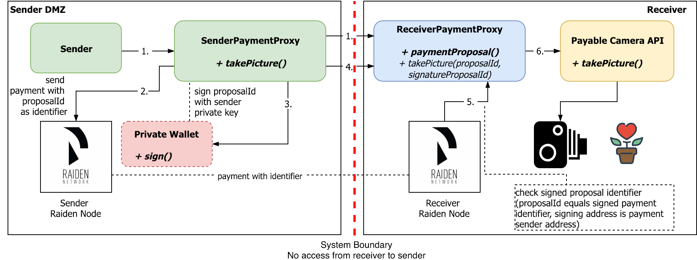

# Payable APIs with Raiden Network Payment Channels [receiver payment proxy]

Implementation of the `ReceiverPaymentProxy` component in the overview. This component delivers the service that should be payable with Raiden.  
For demonstration purposes, the `text` service is used, which just returns a String. But an `image` component is included as well, simulating the camera and just returning the Bauhaus logo on each call.



# Prerequisites

* Java 8+
* optional: Git

# Complete Demo Setup

For the complete demo setup, you have to have all the components up and running.

This external service has no other external dependencies and runs standalone.  To use it with the other components, it should be served on port 9500.

| Service | Port |
| --- | --- |
| **Receiver Payment Proxy** | **9500** |
| [Raiden Node](...) | 9200 | 
| [External Service: Camera API](...) | 9100 | 

## For native image creation

* GraalVM (see https://guides.micronaut.io/micronaut-creating-first-graal-app/guide/index.html)

# Setup

* Clone project with `git clone` or download the project as a compressed file
* Set environment variables. Presets are in `application.yml` for Micronaut environment and `raiden-payment-proxy.sh` for native-image usage.

# Run

* Import as Gradle project in IDE and launch Main class   
*or*   
* Build project with `./gradlew run`  
*or*
* Run `./raiden-payment-proxy.sh` after building native-image (macos and linux only)

# Use

Call `http://localhost:9500/api/v1/paymentProposal/0x1/0x2` in HTTP clients like [Restlet Client](https://restlet.com/modules/client/), [SoapUI](https://www.soapui.org/).  
Call with HTTP POST and body:
```
{
  "identifier": 2,
  "amount": 100
}
```