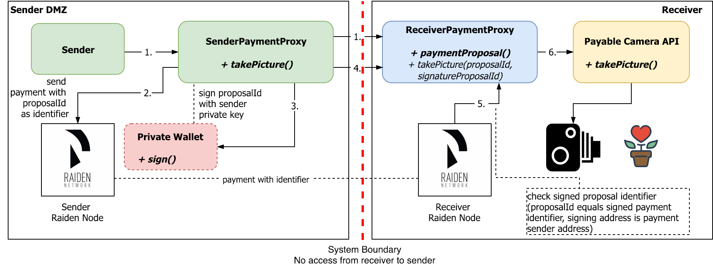

# Payable APIs with Raiden Network Payment Channels [receiver payment sender proxy]

Implementation of the `SenderPaymentProxy` component in the overview. This component wraps the sender's call to the service with the actual payment.  
The usage should be transparent to the user, he calls the HTTP service locally and executes all steps necessary to send the payment and correlate the service request.

* Requesting the unique payment identifier by the `ReceiverPaymentProxy`
* Signing the received `identifier`

# Prerequisites

* Java 8+
* optional: Git

# Complete Demo Setup

For the complete demo setup, you have to have all the components up and running.

This external service has no other external dependencies and runs standalone.  To use it with the other components, it should be served on port 9500.

| Service | Port |
| --- | --- |
| **Sender Payment Proxy** | **9000** |
| [Receiver Payment Proxy](...) | 9500 |
| [Raiden Node](...) | 9200 | 
| [Sender Transaction Signer](...) | 9300 | 

| Environment Variable | Default Value |
| --- | --- |
| RECEIVER_ADDRESS | 0x627306090abaB3A6e1400e9345bC60c78a8BEf57 |
| SENDER_ADDRESS | 0x2284737b7c15c6119589854631c31A7E599A3dB3 |
| TOKEN_ADDRESS | 0x0000000000000000000000000000000000000001 |

## For native image creation

* GraalVM (see https://guides.micronaut.io/micronaut-creating-first-graal-app/guide/index.html)

# Setup

* Clone project with `git clone` or download the project as a compressed file
* Set environment variables. Presets are in `application.yml` for Micronaut environment and `raiden-payment-sender-proxy.sh` for native-image usage.

# Run

* Import as Gradle project in IDE and launch Main class   
*or*   
* Build project with `./gradlew run`  
*or*
* Run `./raiden-payment-sender-proxy.sh` after building native-image (macos and linux only)

# Use

Call `http://localhost:9000/api/v1/service/delegate` in HTTP clients like [Restlet Client](https://restlet.com/modules/client/), [SoapUI](https://www.soapui.org/).  